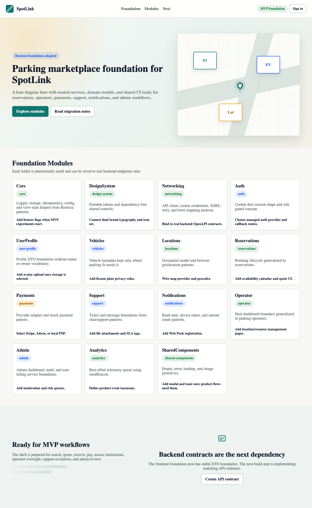
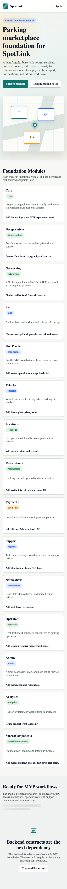

# SpotLink

SpotLink is a parking reservation marketplace foundation. It provides the shared backend, web, and native iOS base that future SpotLink MVP workflows will build on.

The current repository is intentionally foundation-first: it establishes architecture, contracts, security defaults, persistence, native mobile structure, and verification gates without overbuilding product workflows before the domain is ready.





## Current State

| Area | Status | Notes |
| --- | --- | --- |
| Backend | Foundation implemented | Java 21, Spring Boot 3.5, Maven, Flyway, JPA, Security, Actuator, OpenAPI |
| Frontend | Foundation hardened | Angular 20, strict TypeScript, foundation services, API contracts, targeted tests |
| iOS | Native foundation implemented | SwiftUI, Swift Package, Xcode project, app resources, test runner |
| API contracts | Documented | Mobile contract, JSON fixtures, OpenAPI draft, Swift DTO alignment guide |
| Product workflows | Not complete | MVP flows such as map search, quote, reserve, and payment confirmation are next |

## Product Model

SpotLink uses parking-specific terminology throughout the codebase:

| Term | Meaning |
| --- | --- |
| `customer` | Person searching for and reserving parking |
| `operator` | Person or team managing parking locations and resources |
| `reservation` | Booked parking time window |
| `parking location` | Physical place where parking inventory exists |
| `parking resource` | Reservable parking inventory at a location |
| `vehicle` | Customer vehicle used for fit, access, and compatibility checks |

Car-rental workflows are intentionally out of scope. The foundation does not include driver-license verification, rental agreements, damage claims, no-show flows, payout ledgers, or rent-a-car compliance logic.

## Architecture

```text
.
|-- apps/
|   |-- backend/                  # Spring Boot API foundation
|   |-- frontend/                 # Angular web foundation
|   `-- ios/                      # Native SwiftUI iOS foundation
|-- docs/
|   |-- api/                      # Frontend API draft and contract notes
|   |-- ios-enterprise-readiness/ # iOS product, QA, security, and launch readiness docs
|   `-- mobile-api-contract/      # Authoritative mobile API contract and fixtures
|-- SPOTLINK_BACKEND_FOUNDATION_MIGRATION.md
|-- SPOTLINK_FRONTEND_FOUNDATION_HARDENING.md
|-- SPOTLINK_FOUNDATION_MIGRATION.md
|-- SPOTLINK_IOS_FOUNDATION_MIGRATION.md
|-- .env.example
|-- package.json
`-- README.md
```

## Backend

Location: [apps/backend](apps/backend)

The backend is a production-minded Spring Boot foundation with:

- Cookie/session auth for web clients.
- Bearer-token mobile auth with refresh-token lifecycle.
- Role model: `CUSTOMER`, `OPERATOR`, `SUPPORT`, `ADMIN`.
- `/api` routes plus `/api/v1` mobile compatibility aliases.
- Flyway migrations for a clean SpotLink schema.
- Global error handling, validation mapping, request correlation IDs, pagination helpers, CORS, CSRF, health, actuator, and OpenAPI.
- Foundation modules for users, vehicles, locations, reservations, payments, support, notifications, operator, admin, audit, analytics, and idempotency.

Default local persistence uses H2. PostgreSQL is supported through environment configuration.

## Frontend

Location: [apps/frontend](apps/frontend)

The frontend is an Angular foundation with:

- Strict TypeScript.
- Modular `foundation` services and models.
- Auth, profile, vehicles, locations, reservations, payments, support, notifications, operator, admin, and analytics boundaries.
- HTTP client contracts, retry handling, credential handling, API error types, and idempotency helpers.
- Design-system primitives and shared loading, empty, error, and image components.
- Focused Jasmine/Karma tests for the hardened foundation layer.

## iOS

Location: [apps/ios](apps/ios)

The iOS foundation is native Swift/SwiftUI, not a webview shell.

It includes:

- [SpotLink.xcodeproj](apps/ios/SpotLink.xcodeproj)
- Swift Package foundation under [apps/ios/SpotLink](apps/ios/SpotLink)
- Session-aware app shell.
- Typed services and models for the same foundation domains as the backend/frontend.
- Keychain-ready session storage.
- Request correlation, analytics, push notification, location, and API client foundations.
- App resources: Info.plist, privacy manifest, asset catalog, entitlements placeholder.
- Native SwiftUI customer MVP slice za pretragu, rezervaciju, potvrdu i podrsku.

Open this project in Xcode:

```bash
open apps/ios/SpotLink.xcodeproj
```

Full simulator build/test requires Xcode.app and accepted Apple SDK licenses.

## Prerequisites

| Tool | Version / Requirement |
| --- | --- |
| Node.js | `^20.19.0`, `^22.12.0`, or `^24.0.0` (LTS only; v25+ not supported) |
| npm | `>=10` |
| Java | 21 |
| Maven | 3.9+ preporuceno |
| Swift | Swift 6 toolchain |
| Xcode | Potrebno za iOS simulator buildove i TestFlight pripremu |
| PostgreSQL | Opciono za lokalni razvoj; H2 je podrazumevani fallback |

Pinned Node verzija je u `.nvmrc` (`22`). Ako koristis nvm:

```bash
nvm install && nvm use
```

If Apple tooling reports a license error, accept the local license before running iOS commands:

```bash
sudo xcodebuild -license
```

## Configuration

Start from the checked-in environment template:

```bash
cp .env.example .env
```

Do not commit `.env` or real secrets.

Important backend variables:

| Variable | Purpose |
| --- | --- |
| `DATABASE_URL` | JDBC URL for H2/PostgreSQL |
| `DATABASE_USERNAME` | Database username |
| `DATABASE_PASSWORD` | Database password |
| `JWT_SECRET` | 32+ byte secret string for mobile bearer auth |
| `JWT_ACCESS_TOKEN_TTL_MINUTES` | Mobile access-token TTL |
| `JWT_REFRESH_TOKEN_TTL_DAYS` | Mobile refresh-token TTL |
| `CORS_ORIGINS` | Allowed web origins |
| `COOKIE_SECURE` | Secure cookie flag |
| `MOCK_PAYMENT_ENABLED` | Enables/disables mock payment provider |

Production profiles reject the built-in development JWT secret.

Vazno za iOS mapu:

| Variable | Purpose |
| --- | --- |
| `SPOTLINK_MAPBOX_PUBLIC_TOKEN` | Javni Mapbox token koji se ucitava u runtime-u za iOS mapu |

- iOS app target koristi `SPOTLINK_MAPBOX_PUBLIC_TOKEN` umesto oslanjanja na hardkodovan `MBXAccessToken`.
- Ako token nije dostupan, aplikacija automatski pada nazad na `MapKit` fallback prikaz.
- Produkcioni token treba uneti kroz build settings, xcconfig ili CI secret, ne direktno u repozitorijum.

## Local Development

### Quickstart (H2 in-memory, no Postgres required)

```bash
# 1. Podesavanje (jednom)
make env          # kreiranje .env iz .env.example
make install      # npm install za frontend

# 2. Pokretanje
make dev          # backend (port 8080) + frontend (port 4200) paralelno
# ili pojedinacno:
make backend
make frontend
```

Backend automatski primenjuje Flyway migracije i (`dev` profil) sidi demo naloge:

| Nalog | Email | Lozinka | Uloge |
| --- | --- | --- | --- |
| Admin | `admin@spotlink.rs` | `Demo1234!` | ADMIN, CUSTOMER |
| Operater | `operator@spotlink.rs` | `Demo1234!` | OPERATOR, CUSTOMER |
| Korisnik | `korisnik@spotlink.rs` | `Demo1234!` | CUSTOMER |

Demo lokacija: `Parking Trg Republike – Demo`, Beograd (44.8175, 20.4562)
- Mesto A-01 – samo online placanje
- Mesto B-01 – placanje po dolasku (pay-on-arrival)

### Health check

```bash
curl http://localhost:8080/api/health
# {"status":"UP"}

curl http://localhost:8080/api/actuator/health
```

### OpenAPI (Swagger UI)

```
http://localhost:8080/api/swagger-ui
```

## Installation

Install frontend dependencies:

```bash
npm install --prefix apps/frontend
# or
make install
```

Maven and SwiftPM resolve backend/iOS dependencies through their own toolchains.

## Common Commands

`make help` prikazuje sve dostupne Makefile naredbe.

| npm/make naredba | Svrha |
| --- | --- |
| `make dev` | Backend + frontend paralelno |
| `make backend` | Spring Boot backend (dev profil, H2) |
| `make frontend` | Angular dev server |
| `make test` | Backend + frontend testovi |
| `make test-backend` | Maven testovi |
| `make test-frontend` | Angular ChromeHeadless testovi (CI=1) |
| `make test-ios` | iOS Swift testovi |
| `make build` | CI Angular produkcioni build |
| `make build-backend` | Maven package (preskoci testove) |
| `npm run start` | Angular dev server |
| `npm run start:backend` | Spring Boot (dev profil) |
| `npm run build` | Build Angular frontend |
| `npm run build:backend` | Package backend jar |
| `npm run build:ios` | Build iOS Swift package |
| `npm run build:dev` | Build Angular development bundle |
| `npm run test` | Frontend testovi (CI=1) |
| `npm run test:backend` | Backend Maven testovi |
| `npm run test:ios` | iOS Swift testovi |

Backend verify:

```bash
mvn -f apps/backend/pom.xml verify
```

Frontend headless test:

```bash
npm --prefix apps/frontend run test -- --watch=false --browsers=ChromeHeadless
```

iOS simulator build, after full Xcode is installed:

```bash
xcodebuild build \
  -project apps/ios/SpotLink.xcodeproj \
  -scheme SpotLink \
  -destination 'platform=iOS Simulator,name=iPhone 16'
```

## API Surface

The backend runs under `/api`.

Examples:

| Endpoint | Purpose |
| --- | --- |
| `GET /api/health` | Service health |
| `POST /api/auth/login` | Web cookie/session login |
| `POST /api/auth/token` | Mobile bearer-token login |
| `POST /api/auth/token/refresh` | Refresh-token rotation |
| `POST /api/auth/token/revoke` | Refresh-token revocation |
| `GET /api/auth/me` | Current user profile |
| `GET /api/locations/search` | Location search foundation |
| `POST /api/reservations/quote` | Reservation quote foundation |
| `POST /api/reservations` | Idempotent reservation creation |

Mobile clients may use `/api/v1/...` aliases for the mobile-critical API surface.

Authoritative mobile contract:

- [docs/mobile-api-contract/SPOTLINK_MOBILE_API_CONTRACT.md](docs/mobile-api-contract/SPOTLINK_MOBILE_API_CONTRACT.md)
- [docs/mobile-api-contract/openapi-mobile-v1.yaml](docs/mobile-api-contract/openapi-mobile-v1.yaml)
- [docs/mobile-api-contract/SWIFT_DTO_ALIGNMENT_GUIDE.md](docs/mobile-api-contract/SWIFT_DTO_ALIGNMENT_GUIDE.md)
- [docs/mobile-api-contract/json-fixtures](docs/mobile-api-contract/json-fixtures)

## Verification Baseline

The foundation has been verified with:

- Backend Maven tests and package verification.
- Frontend Angular headless tests.
- Frontend production build.
- iOS Swift package build.
- iOS Swift test suite preko `swift test` i `npm run test:ios`.
- JSON fixture parsing.
- OpenAPI YAML parsing.
- Backend local smoke tests for health, mobile token issuance, refresh rotation, and revoke.

Recommended pre-push check:

```bash
make test-backend
make test-frontend
make build
mvn -f apps/backend/pom.xml verify
swift build --package-path apps/ios/SpotLink
swift test --package-path apps/ios/SpotLink
```

## Documentation Index

| Document | Purpose |
| --- | --- |
| [SPOTLINK_FOUNDATION_MIGRATION.md](SPOTLINK_FOUNDATION_MIGRATION.md) | Original frontend foundation transfer notes |
| [SPOTLINK_BACKEND_FOUNDATION_MIGRATION.md](SPOTLINK_BACKEND_FOUNDATION_MIGRATION.md) | Backend foundation audit, reuse map, modules, endpoints, migrations |
| [SPOTLINK_FRONTEND_FOUNDATION_HARDENING.md](SPOTLINK_FRONTEND_FOUNDATION_HARDENING.md) | Frontend hardening changes and verification |
| [SPOTLINK_IOS_FOUNDATION_MIGRATION.md](SPOTLINK_IOS_FOUNDATION_MIGRATION.md) | Native iOS foundation structure and verification |
| [docs/mobile-api-contract](docs/mobile-api-contract) | Mobile API contract, fixtures, Swift DTO guide, backend gap report |
| [docs/ios-enterprise-readiness](docs/ios-enterprise-readiness) | iOS UX, architecture, QA, security, TestFlight, App Store readiness |
| [docs/api](docs/api) | Frontend API contract draft |

## Source Control Standards

This repository uses a source-control style suitable for staged platform work:

- Keep `main` releasable.
- Prefer small, reviewable commits grouped by architectural concern.
- Use Conventional Commit style where possible: `feat`, `fix`, `chore`, `docs`, `test`, `refactor`.
- Do not mix generated artifacts with source changes.
- Do not commit local state: `.env`, `target`, `dist`, `.build`, `xcuserdata`, `.xcuserstate`.
- Keep backend, frontend, iOS, and docs changes separated unless a single product slice requires them together.
- Run the relevant verification commands before pushing.

Recommended commit order for future vertical slices:

1. API contract update.
2. Backend implementation and tests.
3. iOS/frontend DTO and client alignment.
4. UX implementation.
5. Documentation and release notes.

## Security Notes

- Real secrets belong in environment variables or the deployment secret store.
- `.env.example` is intentionally safe to commit; `.env` is not.
- Production startup rejects the development JWT secret.
- Refresh tokens are stored as hashes, not raw token values.
- Payment and notification providers are abstraction-ready but mock/simple by default.
- Privacy manifests, entitlements, and App Store declarations must be finalized before external TestFlight or App Store submission.

## Known Foundation Limits

These are intentional limits of the current phase:

- The iOS app shell is native but not yet a complete customer product flow.
- Map-grade geospatial search is not fully implemented.
- Payment lifecycle is mock-provider foundation only.
- APNs provider integration is not production complete.
- Account deletion and full privacy workflows are not complete.
- Full iOS simulator validation requires Xcode.app.

## Next Engineering Slice

Recommended first MVP slice:

1. Mobile auth session restore and refresh.
2. Map/list search for parking locations.
3. Location detail with resource compatibility.
4. Reservation quote.
5. Idempotent reservation create.
6. Mock payment confirmation.
7. Confirmation and notification foundation.

Use [docs/mobile-api-contract](docs/mobile-api-contract) as the source of truth before expanding native UI.
