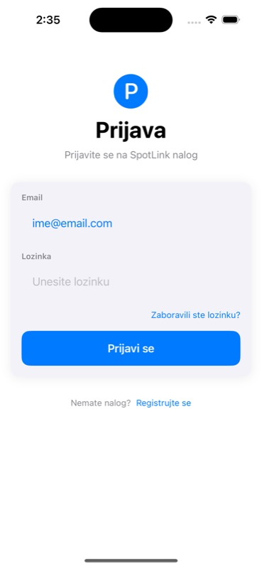
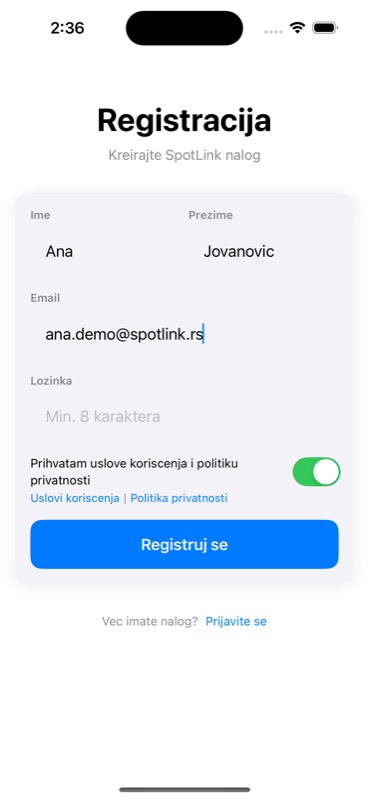
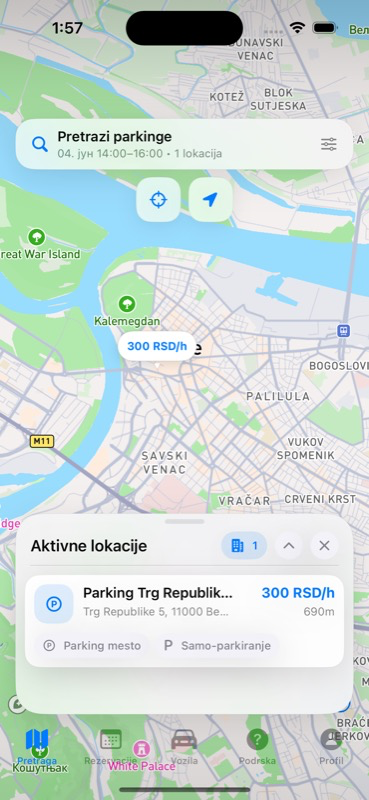
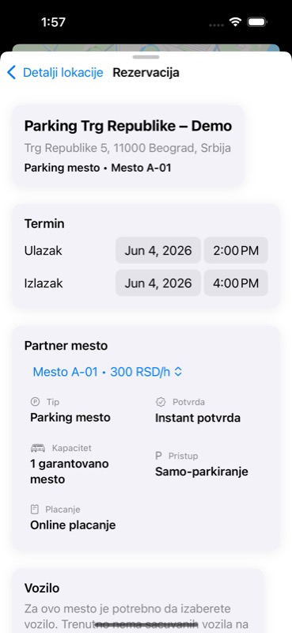
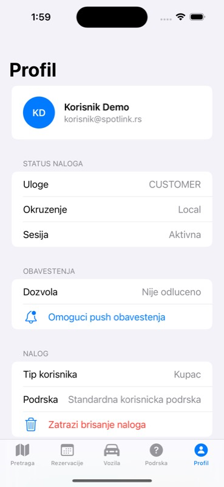
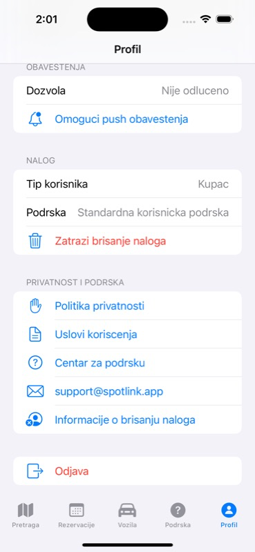
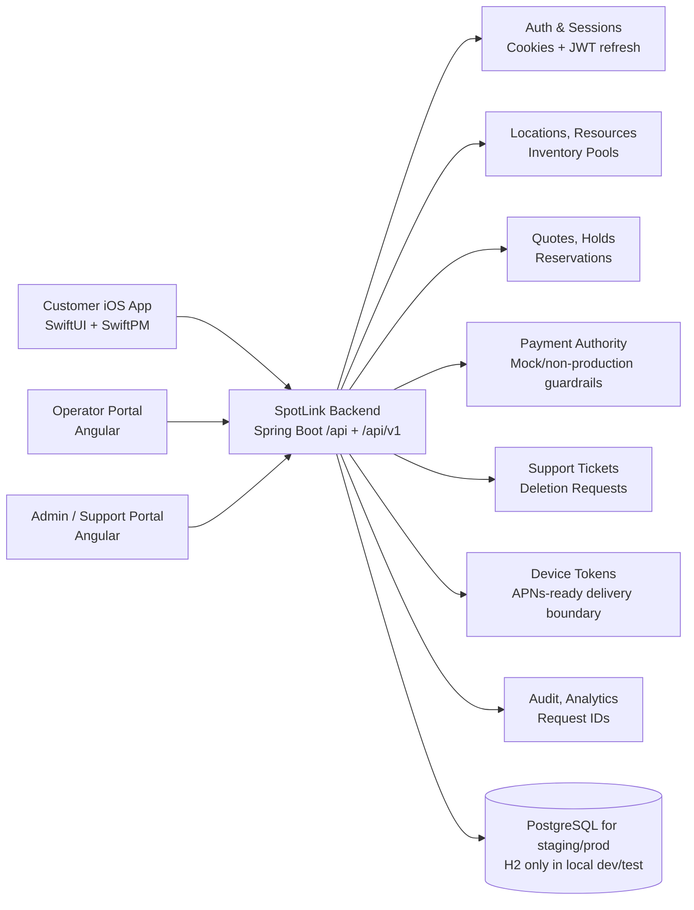

# SpotLink

[](https://github.com/kljajic-luka/SpotLink/actions/workflows/ci.yml)

SpotLink is a native iOS parking reservation app backed by a Spring Boot API and internal operator/admin tooling. It centers the customer mobile workflow around searchable parking inventory, reservation holds, booking operations, payment authority, support, and account lifecycle controls.

This repository is an internal release-readiness baseline, not a production deployment. It is intentionally honest about what is complete, what is guarded, and what still needs external provider access before TestFlight or production.

## iOS App Preview

These screenshots are captured from the real native SwiftUI app running on iPhone Simulator against the local dev backend seed data.

| Login | Registration | Search |
| --- | --- | --- |
|  |  |  |

| Booking | Profile | Account deletion |
| --- | --- | --- |
|  |  |  |

## Why This Is Serious

- One release gate validates backend tests, frontend CI tests/build, SwiftPM tests, Xcode simulator tests, and unsigned Release/Staging iOS builds.
- CI uses the canonical `SpotLinkApp` scheme and keeps `SpotLinkStaging` as a separate unsigned staging build path.
- Backend staging/production startup fails fast on H2/default DB settings, placeholder JWT secrets, wildcard/local CORS, insecure cookies, and production mock payment exposure.
- Payment behavior is authority-driven: clients ask the backend what provider and operations are allowed before showing online-payment actions.
- Push token lifecycle is production-shaped for register/reactivate/unregister, and backend APNs delivery is provider-shaped with safe disabled defaults, server-side preference enforcement, metrics, runtime guards, and token redaction.
- Account deletion has request intake plus admin-reviewed fulfillment/anonymization that preserves reservation/payment/audit history.
- iOS includes privacy manifest, legal/support URL wiring, signed archive/export scaffolding, real app icon asset, and separate Staging bundle ID.
- The repo has a backend Dockerfile and staging/prod env examples, but does not invent cloud infrastructure before provider/DNS/secrets decisions exist.

## Current Status

| Area | Status | Notes |
| --- | --- | --- |
| Backend API | Implemented readiness baseline | Spring Boot 3.5, Java 21, Maven, Flyway, JPA, Security, Actuator, OpenAPI |
| Operator/admin web | Implemented internal portal | Angular 20, guarded routes, operator operations, admin support/payment/account-deletion surfaces |
| iOS app | Native app baseline | SwiftUI, SwiftPM, Xcode project, `SpotLinkApp`, `SpotLinkStaging`, `SpotLinkLocalDevice` schemes |
| Release gate | Green baseline | `make release-gate` is the local proof bar |
| Signed iOS path | Scaffolded only | Archive/export targets require human-owned Apple credentials and provisioning |
| Backend deployment | Provider-neutral readiness | Docker/env/runtime guards exist; real staging provider is not chosen in repo |
| Payments | Provider-ready contracts | Real PSP is not integrated; production mock payment is rejected |
| Push notifications | Delivery readiness scaffolded | APNs provider adapter/config/metrics and preference gates exist; Apple credentials, entitlement, and physical-device delivery are not enabled |
| Privacy/legal | Engineering scaffolding | Owner-approved policy pages and App Store Connect answers are still required |

## Architecture



## Tech Stack

| Surface | Stack |
| --- | --- |
| Backend | Java 21, Spring Boot 3.5, Maven, Spring Security, JPA/Hibernate, Flyway, H2 local/test, PostgreSQL staging/prod config |
| Frontend | Angular 20, strict TypeScript, standalone components, Jasmine/Karma, guarded operator/admin routes |
| iOS | Swift 6, SwiftUI, Swift Package Manager, XCTest/XCUITest, Xcode shared schemes, privacy manifest, app icon catalog |
| Delivery | GitHub Actions CI, Makefile release gate, Docker backend image path, unsigned iOS Release/Staging validation, signed export templates |

## Key Capabilities

- Reservation foundations: location/resource search, reservation quote, idempotent create, booking holds, manual confirmation, cancellation/no-show/refund markers.
- Operator workflows: pilot dashboard, upcoming bookings, check-in/no-show/cancel actions, resource health, pause/resume capacity controls.
- Admin/support workflows: booking search/detail, payment attempts, manual refund marker, support cases, account deletion fulfillment, audit events.
- Mobile auth/session lifecycle: bearer-token login, refresh/revoke contracts, session-aware SwiftUI shell, logout cleanup hooks.
- Payment safety: capabilities endpoint, provider-ready authorize/capture/cancel/refund/webhook/reconciliation contracts, production guard against mock methods.
- Push readiness: authenticated token register/reactivate/unregister endpoints, iOS token persistence/cleanup, backend APNs provider boundary, server-side preference enforcement, privacy-safe payloads/logs, and delivery metrics without committed APNs credentials.
- Account deletion readiness: user request endpoint, duplicate prevention, admin idempotent processing, PII anonymization, auth/device-token revocation, blockers for active/future reservations and unresolved payment states.
- Privacy/compliance scaffolding: iOS `PrivacyInfo.xcprivacy`, legal/support URL config, account deletion documentation, conservative App Store checklist.
- Release engineering: deterministic local gate, CI parity, staging scheme/config, unsigned Release/Staging build validation, signed TestFlight export scaffolding.

## Quickstart

Prerequisites: Java 21, Maven 3.9+, Node.js 22 (`.nvmrc`), npm 10+, Swift 6, and full Xcode for simulator/Xcode build targets.

```bash
make env
make install
make dev
```

Local dev uses H2 in memory and seeds demo accounts:

| Role | Email | Password |
| --- | --- | --- |
| Admin | `admin@spotlink.rs` | `Demo1234!` |
| Operator | `operator@spotlink.rs` | `Demo1234!` |
| Customer | `korisnik@spotlink.rs` | `Demo1234!` |

Health checks:

```bash
curl http://localhost:8080/api/health
curl http://localhost:8080/api/actuator/health/liveness
curl http://localhost:8080/api/actuator/health/readiness
```

## Verification

Run the complete engineering gate before release-readiness changes are considered green:

```bash
make release-gate
```

The target runs backend Maven tests, frontend CI tests, frontend production build, iOS privacy plist lint, SwiftPM clean/test, Xcode simulator tests via `SpotLinkApp`, unsigned Release build, and unsigned Staging build via `SpotLinkStaging`.

Useful focused checks:

```bash
make validate-backend-runtime-config
make validate-mobile-api-contract
make validate-notification-preferences
make validate-push-delivery-readiness
make validate-pre-staging-hardening
make validate-ios-privacy-config
make validate-ios-signed-config
make build-ios-staging-unsigned
make build-backend-image
```

`make validate-mobile-api-contract` is also part of the pre-staging gate. It checks generated backend OpenAPI route coverage for mobile-critical endpoints and decodes checked-in mobile JSON fixtures through the actual Swift models.

`make validate-notification-preferences` is also part of the pre-staging gate through the push readiness target. It proves transactional push delivery respects server-side reservation, payment, and support preference gates without suppressing in-app notification persistence.

`make validate-push-delivery-readiness` is also part of the pre-staging gate. It proves provider selection/runtime guards, post-commit notification delivery semantics, invalid-token deactivation, inactive-token skipping, preference skips, metrics, and log redaction without contacting APNs.

For the local pre-staging hardening bar, run:

```bash
make pre-staging-gate
```

Signed archive/export is intentionally outside the release gate and fails clearly without Apple credentials:

```bash
SPOTLINK_APPLE_TEAM_ID=<TEAM_ID> \
SPOTLINK_STAGING_PROFILE_SPECIFIER="<App Store profile for com.spotlink.app.staging>" \
make export-ios-staging-testflight
```

## Configuration And Safety

Staging/production backend profiles must use PostgreSQL, explicit HTTPS CORS origins, secure cookies, and a real 32+ byte JWT secret. Production must keep mock payments disabled and should keep online payments off until a real PSP provider is implemented. Push delivery must also be explicitly disabled or fully configured; production rejects sandbox APNs.

Placeholder-only runtime examples:

- [apps/backend/env/staging.env.example](apps/backend/env/staging.env.example)
- [apps/backend/env/production.env.example](apps/backend/env/production.env.example)

The iOS staging scheme points at `https://api-staging.spotlink.app/api`, but the repository intentionally does not include provider-specific staging deployment code because cloud project, DNS, DB, secret-store, CORS origin, and deploy approval decisions are external.

## Repository Map

```text
apps/backend/      Spring Boot API, persistence, runtime guards, Dockerfile, tests
apps/frontend/     Angular operator/admin portal and foundation services
apps/ios/          SwiftUI app, Swift Package, Xcode project, schemes, iOS resources
docs/api/          Frontend/API draft contracts
docs/mobile-api-contract/  Mobile API contract, fixtures, Swift DTO guide
docs/ios-enterprise-readiness/  iOS readiness audits, QA, security, TestFlight gap reports
docs/assets/       README screenshots and visual assets
.github/workflows/ CI gate definitions
Makefile           Local development, validation, build, archive/export, release-gate targets
```

## Deeper Docs

| Document | Purpose |
| --- | --- |
| [docs/PORTFOLIO_OVERVIEW.md](docs/PORTFOLIO_OVERVIEW.md) | Short product and engineering brief for reviewers |
| [docs/pre-staging-readiness.md](docs/pre-staging-readiness.md) | Abuse throttling, reset delivery, observability, and local pre-staging gate |
| [docs/app-store-privacy-readiness.md](docs/app-store-privacy-readiness.md) | App Store privacy engineering checklist and remaining legal-owner work |
| [apps/ios/README.md](apps/ios/README.md) | iOS schemes, staging config, signed export path, privacy/APNs/payment notes |
| [docs/mobile-api-contract/SPOTLINK_MOBILE_API_CONTRACT.md](docs/mobile-api-contract/SPOTLINK_MOBILE_API_CONTRACT.md) | Mobile-facing API contract |
| [docs/mobile-api-contract/openapi-mobile-v1.yaml](docs/mobile-api-contract/openapi-mobile-v1.yaml) | Mobile OpenAPI draft |
| [docs/ios-enterprise-readiness/README.md](docs/ios-enterprise-readiness/README.md) | iOS enterprise readiness documentation index |
| [docs/assets/README.md](docs/assets/README.md) | Screenshot capture notes |

## Remaining External Blockers

- Real staging infrastructure: cloud provider/project, DNS/TLS for `api-staging.spotlink.app`, PostgreSQL instance, secret storage, deploy/rollback owners.
- Apple signing/TestFlight: Apple Developer team, distribution certificate, provisioning profiles, App Store Connect app records, human-controlled upload.
- Real PSP: provider selection, credentials, webhook signature verification, SCA/deep-link return, capture/refund reconciliation, settlement reporting.
- Real APNs: Push Notifications entitlement, APNs key/certificate in the deployment secret store, Apple Developer bundle/topic alignment, physical-device sandbox/production delivery validation, and final payload/privacy review.
- Legal/privacy ownership: published Terms, Privacy Policy, support/account-deletion pages, App Store Connect privacy answers approved by the responsible owner.

## Source Control Standards

- Keep `main` releasable and run the relevant gate before pushing.
- Prefer small Conventional Commit slices grouped by backend/frontend/iOS/docs concern.
- Do not commit `.env`, real secrets, `target`, `dist`, `.build`, `DerivedData`, `xcuserdata`, archives, exports, or simulator state.
- Keep signed Apple credentials, APNs material, PSP credentials, and production secrets outside the repository.
